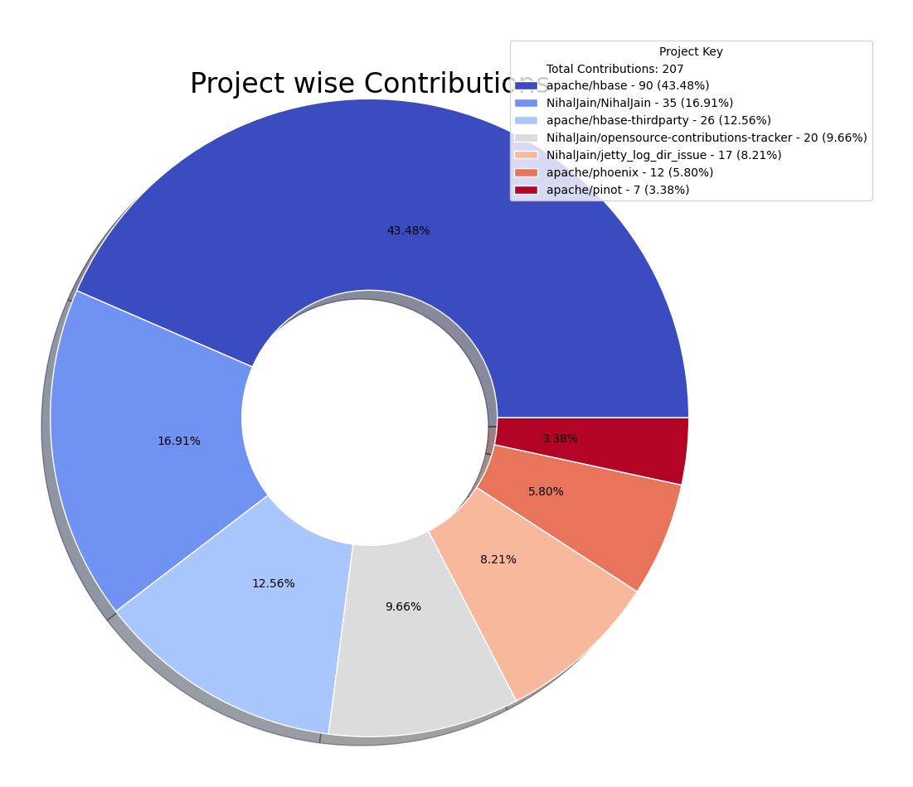
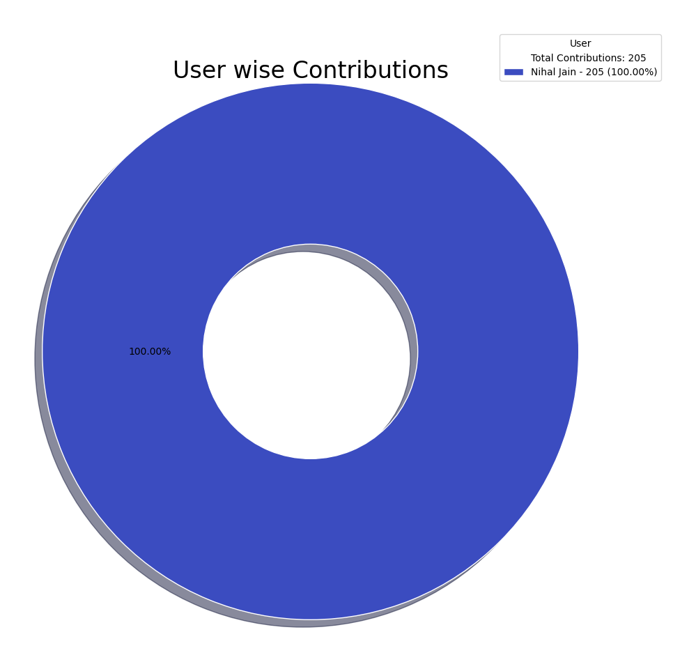

# OpenSource Contributions Report

Report auto-generated on: 2026-02-06 01:21:14

## Overall Summary

| Metric | Value |
|--------|-------|
| Total number of projects | 7 |
| Total number of repositories | 7 |
| Total number of contributions | 204 |
| Number of commits | 192 |
| Number of pull requests (Open) | 12 |

  
  

## Summary of Contributions by each project

| Project Key | Repositories | Users | Commits | Pull Requests (Open) | Overall Contribution |
|--------------|--------------|-------|---------|----------------------|----------------------|
| apache/hbase |  [apache/hbase](https://github.com/apache/hbase) |  [Nihal Jain](https://github.com/NihalJain) | 84 | 6 | 90 |
| NihalJain/NihalJain |  [NihalJain/NihalJain](https://github.com/NihalJain/NihalJain) |  [Nihal Jain](https://github.com/NihalJain) | 35 | 0 | 35 |
| apache/hbase-thirdparty |  [apache/hbase-thirdparty](https://github.com/apache/hbase-thirdparty) |  [Nihal Jain](https://github.com/NihalJain) | 24 | 2 | 26 |
| NihalJain/opensource-contributions-tracker |  [NihalJain/opensource-contributions-tracker](https://github.com/NihalJain/opensource-contributions-tracker) |  [Nihal Jain](https://github.com/NihalJain) | 18 | 1 | 19 |
| NihalJain/jetty_log_dir_issue |  [NihalJain/jetty_log_dir_issue](https://github.com/NihalJain/jetty_log_dir_issue) |  [Nihal Jain](https://github.com/NihalJain) | 16 | 1 | 17 |
| apache/phoenix |  [apache/phoenix](https://github.com/apache/phoenix) |  [Nihal Jain](https://github.com/NihalJain) | 12 | 0 | 12 |
| apache/pinot |  [apache/pinot](https://github.com/apache/pinot) |  [Nihal Jain](https://github.com/NihalJain) | 3 | 2 | 5 |

## Summary of Contributions by each user

| User | Repositories | Commits | Pull Requests (Open) | Overall Contribution |
|------|--------------|---------|----------------------|----------------------|
|  [Nihal Jain](https://github.com/NihalJain) |  [NihalJain/NihalJain](https://github.com/NihalJain/NihalJain)  [NihalJain/jetty_log_dir_issue](https://github.com/NihalJain/jetty_log_dir_issue)  [NihalJain/opensource-contributions-tracker](https://github.com/NihalJain/opensource-contributions-tracker)  [apache/hbase](https://github.com/apache/hbase)  [apache/hbase-thirdparty](https://github.com/apache/hbase-thirdparty)  [apache/phoenix](https://github.com/apache/phoenix)  [apache/pinot](https://github.com/apache/pinot) | 192 | 12 | 204 |

## Detailed Contributions

| Project Key | Repository | User | Commits | Pull Requests (Open) | Overall Contribution |
|--------------|------------|------|---------|----------------------|----------------------|
| apache/hbase |  [apache/hbase](https://github.com/apache/hbase) |  [Nihal Jain](https://github.com/NihalJain) | 84 | 6 | 90 |
| apache/hbase-thirdparty |  [apache/hbase-thirdparty](https://github.com/apache/hbase-thirdparty) |  [Nihal Jain](https://github.com/NihalJain) | 24 | 2 | 26 |
| apache/phoenix |  [apache/phoenix](https://github.com/apache/phoenix) |  [Nihal Jain](https://github.com/NihalJain) | 12 | 0 | 12 |
| apache/pinot |  [apache/pinot](https://github.com/apache/pinot) |  [Nihal Jain](https://github.com/NihalJain) | 3 | 2 | 5 |
| NihalJain/jetty_log_dir_issue |  [NihalJain/jetty_log_dir_issue](https://github.com/NihalJain/jetty_log_dir_issue) |  [Nihal Jain](https://github.com/NihalJain) | 16 | 1 | 17 |
| NihalJain/NihalJain |  [NihalJain/NihalJain](https://github.com/NihalJain/NihalJain) |  [Nihal Jain](https://github.com/NihalJain) | 35 | 0 | 35 |
| NihalJain/opensource-contributions-tracker |  [NihalJain/opensource-contributions-tracker](https://github.com/NihalJain/opensource-contributions-tracker) |  [Nihal Jain](https://github.com/NihalJain) | 18 | 1 | 19 |
